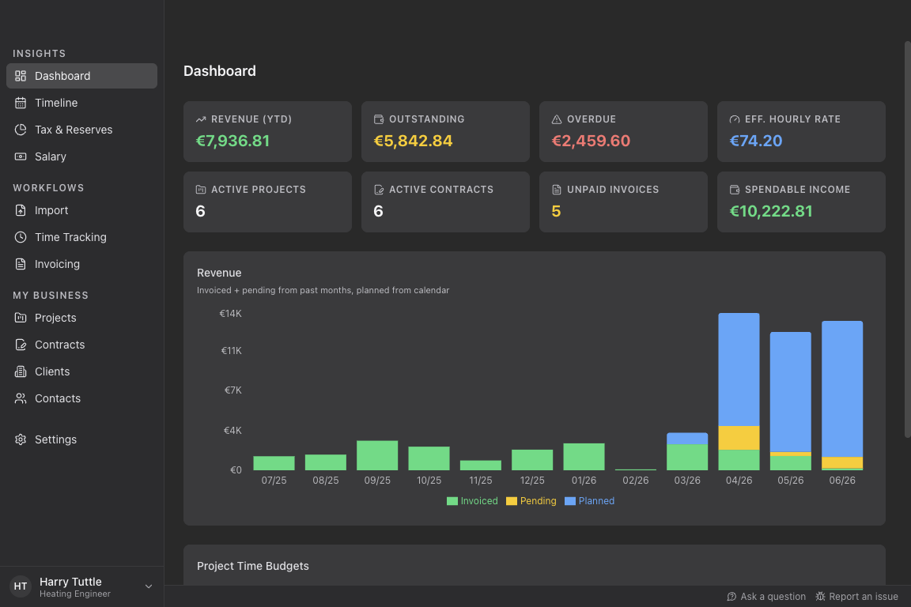
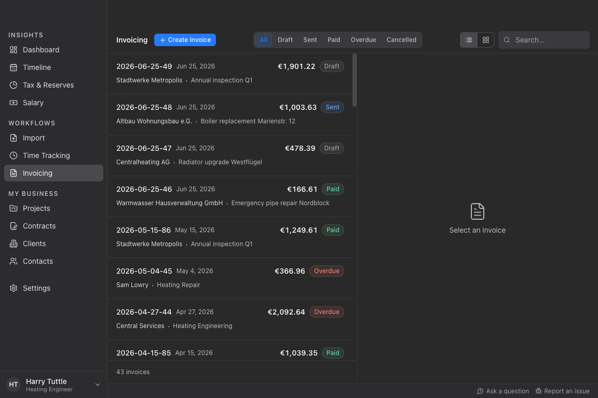

 

  <h1>Tuttle</h1>

  
  
  
  

  
<b>Time and money management for freelancers</b>

  

    <blockquote align="left">
    HARRY TUTTLE: Bloody paperwork. Huh!
     
    SAM LOWRY: I suppose one has to expect a certain amount.
     
    HARRY TUTTLE: Why? I came into this game for the action, the excitement. Go anywhere, travel light, get in, get out, wherever there's trouble, a man alone.
    </blockquote>
     
  

  

    

> **Note**: Tuttle is currently in development. The current version is a prototype, not quite ready for production use. However, we are happy to receive feedback from testers.

## What Tuttle Does

Tuttle is a desktop app that takes the paperwork off your plate as a freelancer:

- **Track your time** — import it from your calendar or from your time-tracking tool.
- **Generate invoices and timesheets** — automatically from your tracked time, or by entering hours and days manually, then export to PDF and send by email.
- **See your business at a glance** — a dashboard with revenue, outstanding invoices, project budgets, and key performance indicators.
- **Keep your data private** — everything is processed and stored locally on your device, with no central data collection.

## Mission Statement

The working world is changing, the trend is towards freelancing: software developers, designers and journalists appreciate the freedom and creative possibilities of solo self-employment. More and more professionals are choosing it for themselves. It allows them to specialize and gain experience with many projects and clients.

With freelancing, there are many side activities: Marketing, client communication, legal and financial planning - although the latter probably appeals to few solo self-employed people. But what if software could make financial planning in freelancing almost as easy as being an employee? Our tool minimizes risks and makes the financial part of the job easy. Freelancing becomes more efficient, less risky, and therefore more beginner-friendly.

With Tuttle, we are developing a financial planning tool that is tailored to the needs of solo freelancers. We automate and give freelancers more time to do the work they love.
The application provides analysis and forecasting functions on income, expenses, disposable income, uncertainty management or explainability of the forecast and convinces with portability, among other things.

We develop the solution as a desktop application. Sensitive financial data is processed locally on the end device without central data collection. For data analysis, we rely on open source tools from the Python ecosystem. We are consciously developing a desktop app with local data storage, not a web app, since your business data is none of our business.

## Features

### Dashboard

Get an overview of your freelance business at a glance: revenue, outstanding invoices, project budgets and key performance indicators.

### Time Tracking

Track the time you spend on your projects. Import from your cloud calendar (iCloud), from an ICS file, or from a CSV export of your favorite time tracking tool.

### Invoicing

Generate invoices and timesheets automatically from your time tracking data, or create invoices manually by entering the quantity of hours or days directly. Export to PDF and send via email.

Invoices are generated as **Factur-X / ZUGFeRD** electronic invoices by default: machine-readable XML (EN16931) is embedded directly into the PDF, compliant with EU e-invoicing requirements without changing your workflow.

## Roadmap

### Income Forecasting

Project your income for the next months based on your project planning. See how changes in your schedule affect your bottom line.

### Expense Tracking & Forecasting

Track regular expenses, taxes and social security contributions. Estimate them for the future based on expected revenue.

### Safe to Spend

Calculate your effective income and see how much you can spend without risking your financial security.

## Getting Started

Tuttle is a desktop application for Windows, macOS, and Linux.

> **Note**: There is no stable release yet. The latest builds are pre-releases intended for testers.

1. Go to the [Releases page](https://github.com/tuttle-dev/tuttle/releases) and download the build for your operating system.
2. Install and launch it like any other desktop application.

Your data is stored locally on your device — there is no account to create and no central server involved.

Want to build from source, run the app in development mode, or contribute? See the [Contributing guide](https://github.com/tuttle-dev/tuttle/blob/main/CONTRIBUTING.md).

## Contributing

Your contributions are welcome. The [Contributing guide (CONTRIBUTING.md)](https://github.com/tuttle-dev/tuttle/blob/main/CONTRIBUTING.md) covers the development setup, how to run the app and tests, and the pull request workflow.

## Acknowledgements

This project has received funding by the [Prototype Fund](https://prototypefund.de) in 2022.

## License

Copyright 2022-2026 Christian Staudt and contributors. Licensed under the [GNU General Public License v3.0](LICENSE).
