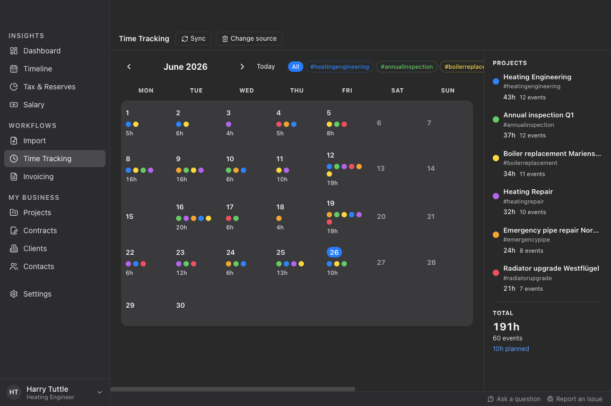

<br />
<div align="center">
  <h1>Tuttle</h1>

  [](https://github.com/tuttle-dev/tuttle/blob/main/LICENSE)
  []()


  <p><b>Time and money management for freelancers</b></p>

  <p align="center">
    <blockquote align="left">
    HARRY TUTTLE: Bloody paperwork. Huh!
    <br />
    SAM LOWRY: I suppose one has to expect a certain amount.
    <br />
    HARRY TUTTLE: Why? I came into this game for the action, the excitement. Go anywhere, travel light, get in, get out, wherever there's trouble, a man alone.
    </blockquote>
    <br />
  </p>
  <p>
    </p>
</div>

> **Note**: Tuttle is currently in development. The current version is a prototype, not quite ready for production use. However, we are happy to receive feedback from testers.

## Mission Statement

The working world is changing, the trend is towards freelancing: software developers, designers and journalists appreciate the freedom and creative possibilities of solo self-employment. More and more professionals are choosing it for themselves. It allows them to specialize and gain experience with many projects and clients.

With freelancing, there are many side activities: Marketing, client communication, legal and financial planning - although the latter probably appeals to few solo self-employed people. But what if software could make financial planning in freelancing almost as easy as being an employee? Our tool minimizes risks and makes the financial part of the job easy. Freelancing becomes more efficient, less risky, and therefore more beginner-friendly.

With Tuttle, we are developing a financial planning tool that is tailored to the needs of solo freelancers. We automate and give freelancers more time to do the work they love.
The application provides analysis and forecasting functions on income, expenses, disposable income, uncertainty management or explainability of the forecast and convinces with portability, among other things.

We develop the solution as a desktop application. Sensitive financial data is processed locally on the end device without central data collection. For data analysis, we rely on open source tools from the Python ecosystem. We are consciously developing a desktop app with local data storage, not a web app, since your business data is none of our business.


## Features

### Business Data Management

Manage your business contacts, clients and contract terms for your projects - all in one place. Entity list views support sorting by any field.


### Time Tracking

Track the time you spend on your projects. Import from your cloud calendar (iCloud), from an ICS file, or from a CSV export of your favorite time tracking tool.




### Invoicing

Generate invoices and timesheets automatically from your time tracking data, or create invoices manually by entering the quantity of hours or days directly. Export to PDF and send via email.


## Roadmap

### Income Forecasting

Project your income for the next months based on your project planning. See how changes in your schedule affect your bottom line.

### Expense Tracking & Forecasting

Track regular expenses, taxes and social security contributions. Estimate them for the future based on expected revenue.

### Safe to Spend

Calculate your effective income and see how much you can spend without risking your financial security.


## Architecture

Tuttle is a desktop application with a Python core and an Electron UI shell.

- **Python core** (`tuttle/`): Business logic, data models, invoicing, tax calculations, and a JSON-RPC server (`tuttle/rpc_server.py`) that exposes the core as a stdio service.
- **Electron shell** (`ui/`): React + TypeScript desktop UI that communicates with the Python core via JSON-RPC over stdio.


## Getting Started

### Prerequisites

- Python 3.12 or newer
- [uv](https://docs.astral.sh/uv/) (recommended) or pip
- Node.js 22 or newer

### Installation

1. Clone the repository:

```shell
git clone https://github.com/tuttle-dev/tuttle.git
cd tuttle
```

2. Install Python dependencies:

```shell
uv sync
```

3. Install Electron dependencies:

```shell
cd ui
npm install
```

### Running the App (Development)

```shell
cd ui
npm run dev
```

This starts the Electron app in development mode. The Python RPC sidecar is spawned automatically.

### Building for Production

```shell
just build
```

This builds the Python sidecar with PyInstaller and packages the Electron app with electron-builder.

### Running the Tests

```shell
uv run pytest
```


## Contributing

Your contributions are welcome. Please follow the [guide (CONTRIBUTING.md)](https://github.com/tuttle-dev/tuttle/blob/main/CONTRIBUTING.md).

[](https://github.com/psf/black)


## Acknowledgements

This project has received funding by the [Prototype Fund](https://prototypefund.de) in 2022.


## License

Copyright 2022-2026 Christian Staudt and contributors. Licensed under the [GNU General Public License v3.0](LICENSE).
