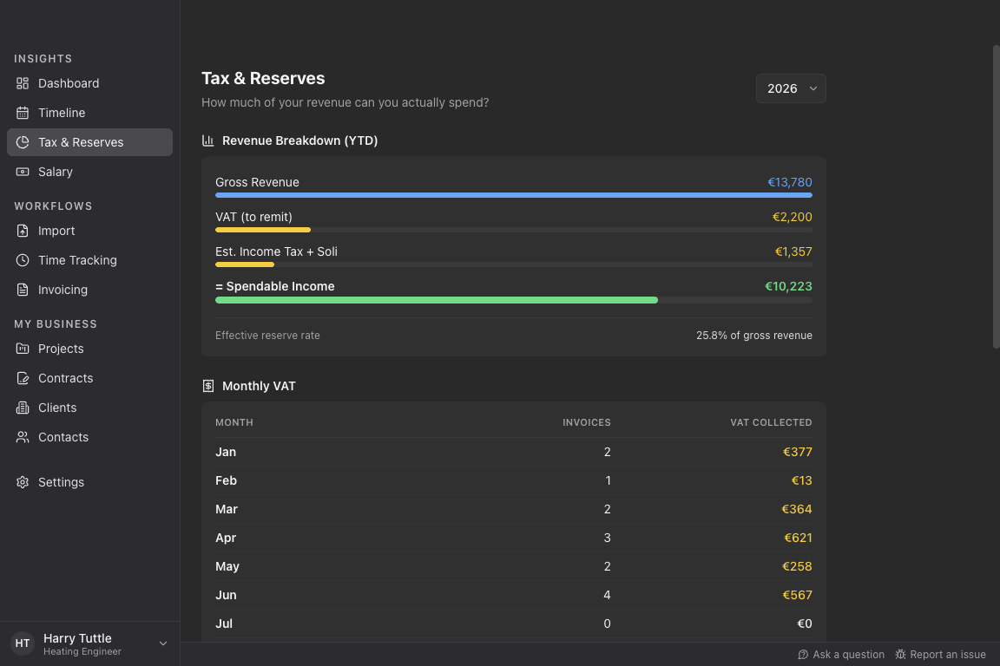
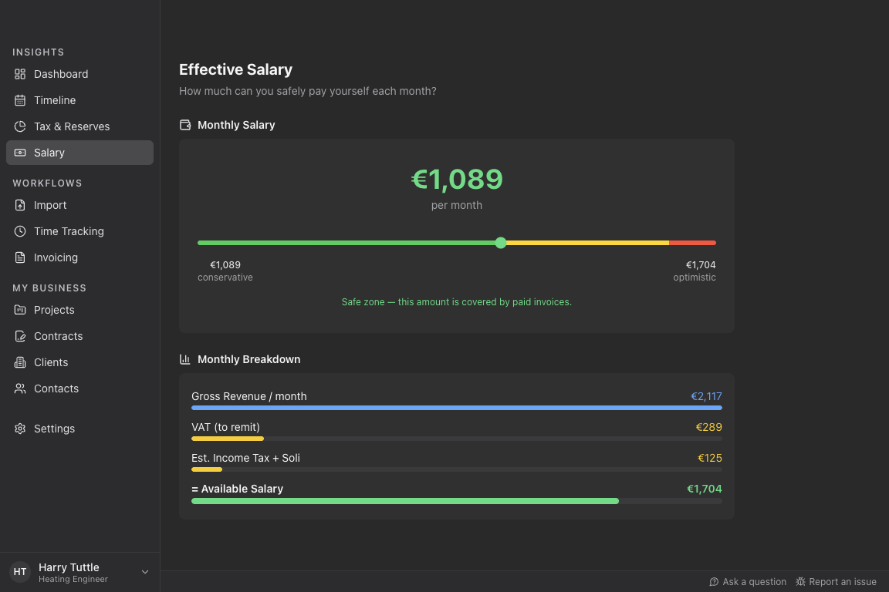
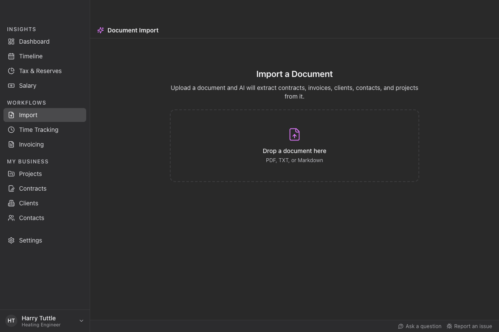

 

  <h1>Tuttle</h1>

  
  
  
  

  
<b>Time and money management for freelancers</b>

  

    <blockquote align="left">
    HARRY TUTTLE: Bloody paperwork. Huh!
     
    SAM LOWRY: I suppose one has to expect a certain amount.
     
    HARRY TUTTLE: Why? I came into this game for the action, the excitement. Go anywhere, travel light, get in, get out, wherever there's trouble, a man alone.
    </blockquote>
     
  

  

    

## What Tuttle Does

Tuttle is a desktop app that takes the paperwork off your plate as a freelancer:

- **Track your time** — import from your calendar, a calendar file, or your favorite time-tracking tool.
- **Generate invoices and timesheets** — from tracked time, from manual entries, or for fixed-price contracts. Export to PDF, send by email. Invoices are generated as Factur-X / ZUGFeRD electronic invoices by default.
- **Import documents with AI** — drop an existing invoice or contract PDF and let Tuttle extract the data automatically.
- **See your business at a glance** — dashboard with revenue, outstanding invoices, project budgets, and key performance indicators.
- **Know what you can spend** — tax and VAT reserve estimates, income forecasting, and an effective salary calculation show how much of your revenue is actually yours.
- **Keep your data private** — everything is processed and stored locally on your device, with no central data collection.

## Mission Statement

More and more professionals choose solo self-employment for the freedom and creative possibilities. But with freelancing come side activities that few enjoy: invoicing, tax planning, client management, time tracking -- each typically handled by a separate tool or spreadsheet.

Tuttle brings all of this into one place. It is a desktop app tailored to solo freelancers that automates the paperwork and gives you more time to do the work you love. Sensitive financial data is processed locally on your device without central data collection -- your business data is none of our business.

## Features

### Dashboard

Get an overview of your freelance business at a glance: revenue, outstanding invoices, project budgets, income forecasting and key performance indicators.

### Time Tracking

Track the time you spend on your projects. Import directly from your calendar, from a calendar file, or from an export of your favorite time tracking tool.

### Invoicing

Generate invoices and timesheets automatically from your time tracking data, or create invoices manually by entering the quantity of hours or days directly. Supports both time-based and fixed-price contracts. Export to PDF and send via email.

Invoices are generated as **Factur-X / ZUGFeRD** electronic invoices by default: machine-readable XML (EN16931) is embedded directly into the PDF, compliant with EU e-invoicing requirements without changing your workflow.

### Tax & Reserves

See how much of your revenue goes to VAT and estimated income tax. A revenue breakdown waterfall shows your spendable income after all reserves.

### Salary

Calculate your effective monthly salary as a freelancer -- what you can safely pay yourself -- based on paid and outstanding invoices, tax reserves, and recurring expenses.

### AI Document Import

Drop an invoice or contract PDF and let Tuttle extract the structured data automatically using AI. Imported data flows into your clients, contracts, and invoices.

## Roadmap

### Expense Management

A dedicated view for managing recurring business expenses (health insurance, professional liability, operating costs) and seeing their impact on your tax estimate and safe-to-spend.

### Deposit & Final Invoices

Support for partial invoicing with payment milestones: deposit invoices, a final invoice that deducts prior deposits, and correct VAT settlement across the chain.

## Getting Started

Tuttle is a desktop application for Windows, macOS, and Linux.

1. Go to the [Releases page](https://github.com/tuttle-dev/tuttle/releases) and download the build for your operating system.
2. Install and launch it like any other desktop application.

Your data is stored locally on your device — there is no account to create and no central server involved.

Want to build from source, run the app in development mode, or contribute? See the [Contributing guide](https://github.com/tuttle-dev/tuttle/blob/main/CONTRIBUTING.md).

## Contributing

Your contributions are welcome. The [Contributing guide (CONTRIBUTING.md)](https://github.com/tuttle-dev/tuttle/blob/main/CONTRIBUTING.md) covers the development setup, how to run the app and tests, and the pull request workflow.

## Acknowledgements

This project has received funding by the [Prototype Fund](https://prototypefund.de) in 2022.

## License

Copyright 2022-2026 Christian Staudt and contributors. Licensed under the [GNU General Public License v3.0](LICENSE).
